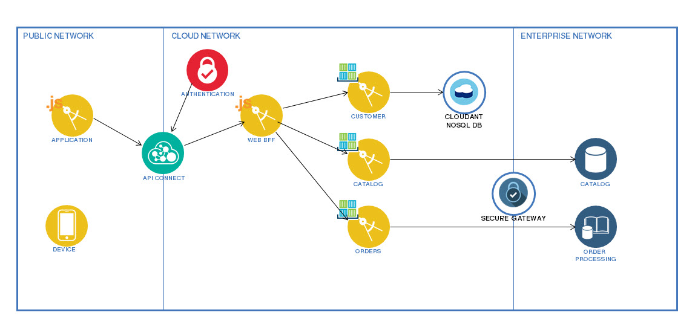

# BobbyCompute

This repository contains the code to implement Enablement sample reference application. The application is loosely based on the BlueCompute R3 application in `https://github.com/ibm-cloud-architecture/refarch-cloudnative`. However, instead of showing off the latest and greatest facility of Bluemix, the purpose of this application is for people to learn developing application in Bluemix. 

The application structure is depicted in the diagram below:

The implementation of the application can be performed as follows:

1. Install the back end environment that simulates on-premises resources:
    - Setup mysql database in a container as a Database of Record
    - Setup Order processing application that receive RESTful call as System of Record application
2. Define Bluemix services that are needed for the application:
    - Define secure gateway to act as the integration mechanism to the on-premises resources:
    - Define cloudant database for Customer microservice
3. Build the container groups that runs the microservices:
    - Customer application
    - Catalog application
    - Orders application
4. Deploy Web Backend-for-frontend as a Cloud Foundry application 
5. Deploy authentication application in a container
6. Deploy API Connect and publish the APIs
7. Deploy Web application

Before you start building your application, there are several steps that you must perform first:

- You must clone this repository to your local disk.

		git clone https://github.com/vbudi000/BobbyCompute

- Initialize the CLI environment 

		bx login
		bx ic init

## MySQL setup

The MySQL is built as follows:

1. Go to the mysql directory:

		cd ~BobbyCompute/mysql

2. Build the container in Bluemix:
 
		bx ic build -t registry.ng.bluemix.net/$(bx ic namespace get)/mysql-${suffix} .

3. Run the container in Bluemix:
 
		bx ic run -max 256 -storage
 
4. Associate an external IP address for the container (may not be needed with SecureGateway client)

		bx ic ip-request
		bx ic ip-bind <ipaddress> mysql-${suffix}

5. Run the load script.

		bx ic exec -t mysql-${suffix} bash

    And run the following:

		mysql -udbuser -p${DBPASS} < load-data.sql
		exit

## Order processing system setup

The order processing takes the order and save it in the orders table. It also substracts the available stock on the items database. 

The order processing receiving REST calls from external system. It is running as a Spring boot application on Jetty server. 

1. Go to the inventory sub-directory

		cd ~/BobbyCompute/inventory

2. Build the image for docker:

		./gradlew build
		./gradlew docker
		cd  docker
		bx ic build -t registry.ng.bluemix.net/$(bx ic namespace get)/backend-${suffix} .

3. Run the container:

		bx ic group 

4. Allocate an IP address for the container

		bx ic ip-request
		bx ic ip-bind <ipaddress> backend-${suffix}

5. Check the implementation once the container group created completely:

		curl http://<backendip>:8080/micro/inventory/13401
		curl http://<backendip>:8080/micro/orders

## Secure Gateway setup

Build the secure gateway environment:

1. Provision Secure Gateway service and define the gateway and destination.

2. Provision a secure gateway client docker container in Bluemix.

3. Make sure that the secure gateway is active and get the destination mapping information.
 

## Cloudant NoSQL setup

Create the cloudant service in Bluemix and collect its credentials.

1. 

## Customer microservice setup

Build customer microservice in a container group.

## Catalog microservice setup

## Orders microservice setup

## Web BFF application setup

Customize and deploy the Web BFF node.JS application:

1. Change directory to the Web BFF 

		cd ~/BobbyCompute/web-bff
		
2. Edit the routes

		cd 

3. Deploy the application

		bx app push

4. Test the BFF application

		curl 

## Authentication application setup

Deploy the authentication application as a container group.

## Deploy API Connect and publish API

Deploy the API Connect service and publish the APIs for the oauth and BFF.

## Deploy Web application

Deploy web application.

